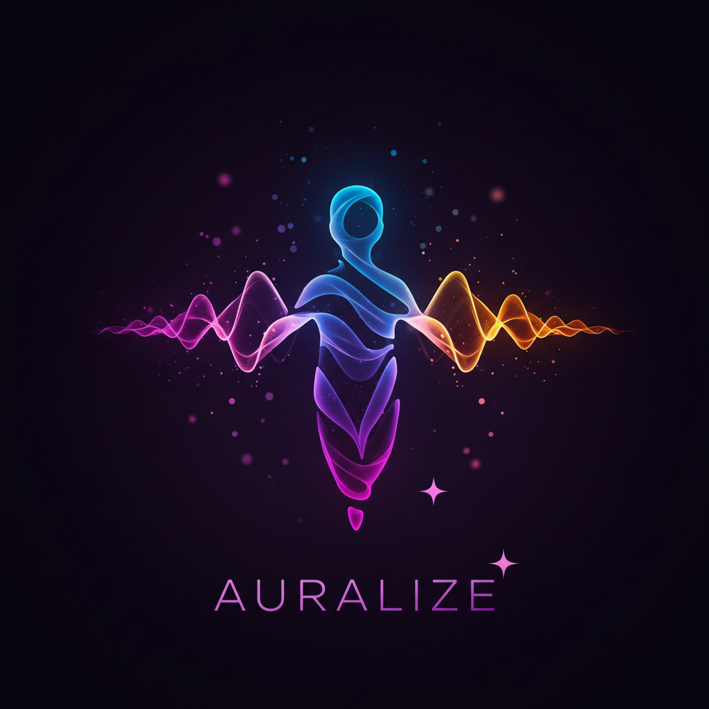

# 🌟 Auralize: Yaratıcı Auranızı AI ile Keşfedin 🌟

*[English](README_EN.md) ∙ [Türkçe](README.md)*

 <!-- ✨ Logo eklenecekse URL buraya gelecek ✨ -->

**Auralize** 🎨, kullanıcıların yaratıcı "auralarını" keşfetmelerine ve geliştirmelerine olanak tanıyan interaktif bir web platformudur. Görsel quiz'ler 🎥, kişisel tercihler 🌈 ve serbest girdilerle yapay zeka destekli **sanat eserleri** 🖼️, **hikayeler** 📖 ve **sesler** 🎶 üreterek herkesin içindeki yaratıcılığı ortaya çıkarmayı hedefliyoruz. Lenovo'nun *"Senin auran sınırsız"* kampanyasına paralel olarak, bu proje kullanıcıların yaratıcı potansiyelini AI ile görselleştiriyor ve topluluk odaklı bir deneyim sunuyor! 🚀

---

## 🎯 Hedef
Auralize, tek seferlik bir sanat eseri üreten bir uygulamadan çok daha fazlasıdır! 🌌 Kullanıcıların yaratıcı yolculuklarını keşfedebilecekleri, zamanla gelişen ve kişiselleştirilmiş bir deneyim sunan bir platform olmayı amaçlar. Her ziyarette **yeni bir şeyler keşfetmek** ✨ ve yaratıcılığı farklı şekillerde ifade etmek, kullanıcıları düzenli olarak geri dönmeye teşvik eder. 💡

---

## ✨ Temel Özellikler ✨
1. **🎮 Dinamik ve Etkileşimli Giriş Arayüzü**  
   - Çok adımlı, oyunlaştırılmış bir *"Yaratıcı Keşif Yolculuğu"*.  
   - Görsel quiz'ler 🖼️, renk paletleri 🎨 ve serbest girdilerle ruh halleri ve yaratıcı eğilimler analiz edilir.

2. **🌟 Zengin ve Evrilen Çıktılar**  
   - AI tarafından üretilen sanat eserleri 🎨, hikayeler/şiirler 📜 ve ses klipleri 🎵.  
   - Kullanıcılar eserlerini zamanla *"evrimleştirebilir"* (örneğin, stil değiştirme, detay ekleme) 🔄.

3. **📊 Kişisel Aura Profili**  
   - Geçmiş eserler ve tercihler için bir *"Yaratıcı Günlük"*.  
   - *"Aura Evrimi"* grafiği ile yaratıcı eğilimlerin zaman içindeki değişimi 📈.

4. **🌐 Topluluk ve Sosyal Etkileşim**  
   - Eserlerinizi paylaşabileceğiniz bir galeri 🖼️.  
   - Yorum 💬, beğeni ❤️ ve haftalık temalarla sosyal bir boyut.

5. **🏆 Oyunlaştırma ve Ödüller**  
   - Rozetler 🥇, puan sistemi 🎯 ve lider tabloları 📋 ile motivasyon.  
   - Haftalık yarışmalar ve etkileşim ödülleri 🎁.

---

## 🛠️ Kullanılan Yapay Zeka Teknolojileri
- **🖼️ Görüntü Üretimi:** *Stable Diffusion* ile benzersiz sanat eserleri.  
- **📝 Metin Üretimi:** *GPT tabanlı modeller* ile kişiselleştirilmiş hikayeler ve şiirler.  
- **🎶 Ses Üretimi (Opsiyonel):** *AudioLDM* ile aura temalı melodiler.  

Bu teknolojiler, kullanıcı girdilerini **zengin ve yaratıcı içeriklere** dönüştürmek için bir araya getirilmiştir! ⚙️

---

## 🤝 Kampanyaya Katkı
"Auralize", Lenovo'nun *"Senin auran sınırsız"* kampanyasını destekleyerek yaratıcılığı teşvik etmeyi ve geniş kitlelere ulaşmayı hedefler. Sosyal medya paylaşım özellikleri 📲 ve topluluk galerisi ile kampanyanın viral yayılımını artırırken, **Lenovo Yoga Aura Edition**'ın yapay zeka gücünü vurgular. 🌍

---

## ⚙️ Kurulum
### 📋 Gereksinimler
- **Node.js** (v16 veya üstü)  
- **Python** (v3.8 veya üstü)  
- Stable Diffusion, GPT ve AudioLDM modelleri için API erişimi veya yerel kurulum  

### 🚀 Adımlar
1. Depoyu klonlayın ve çalıştırın:
   ```bash
   git clone https://github.com/xPoleStarx/auralize.git
   cd auralize

   npm install
   pip install -r requirements.txt

   npm start
